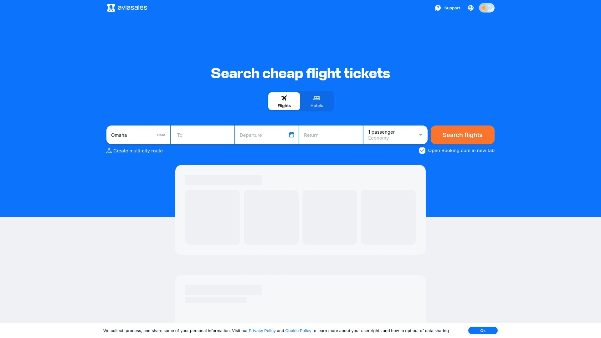
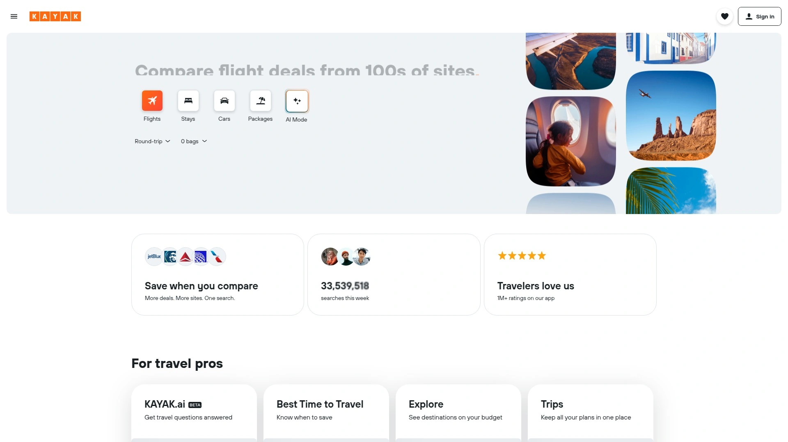
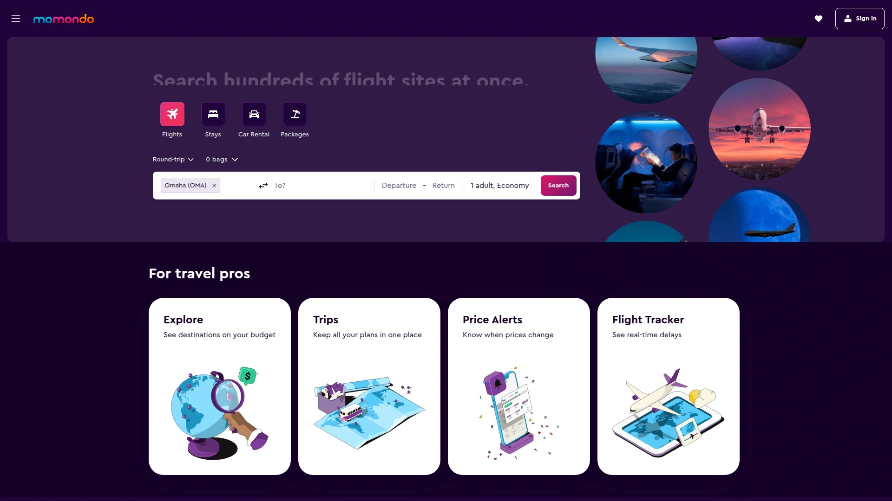
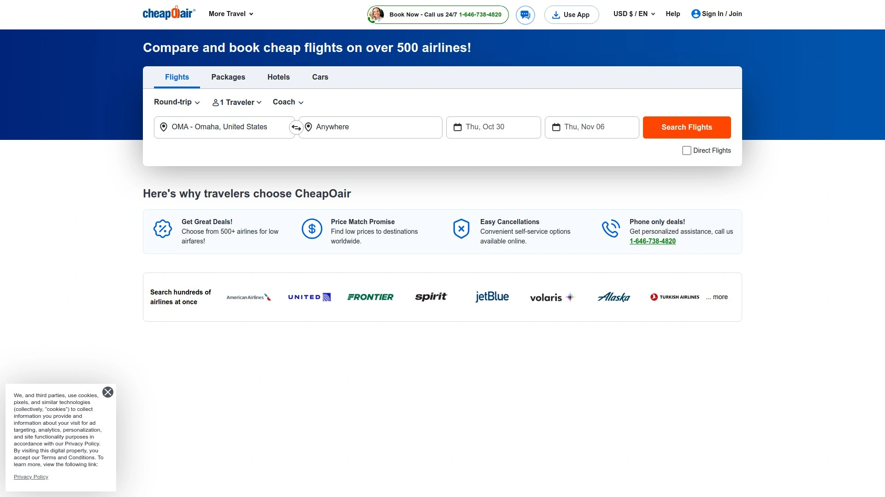
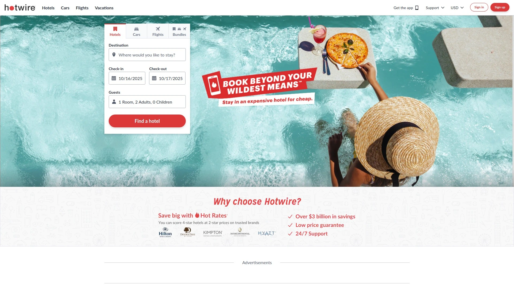
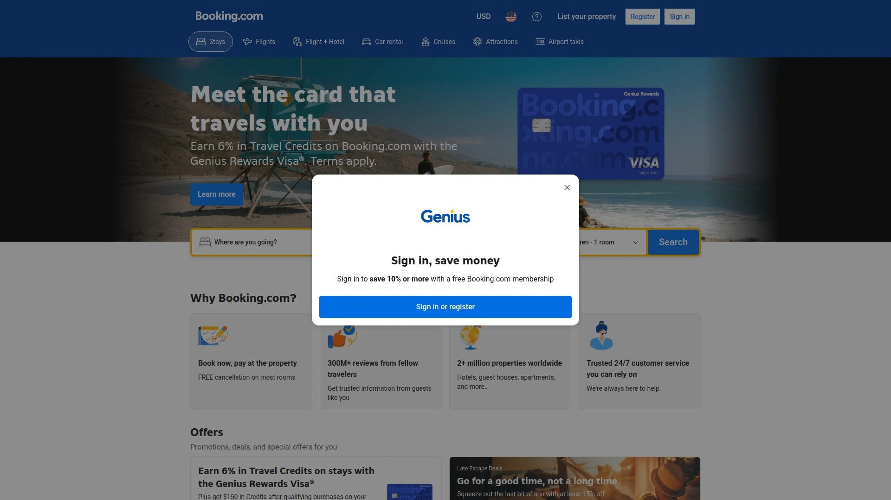
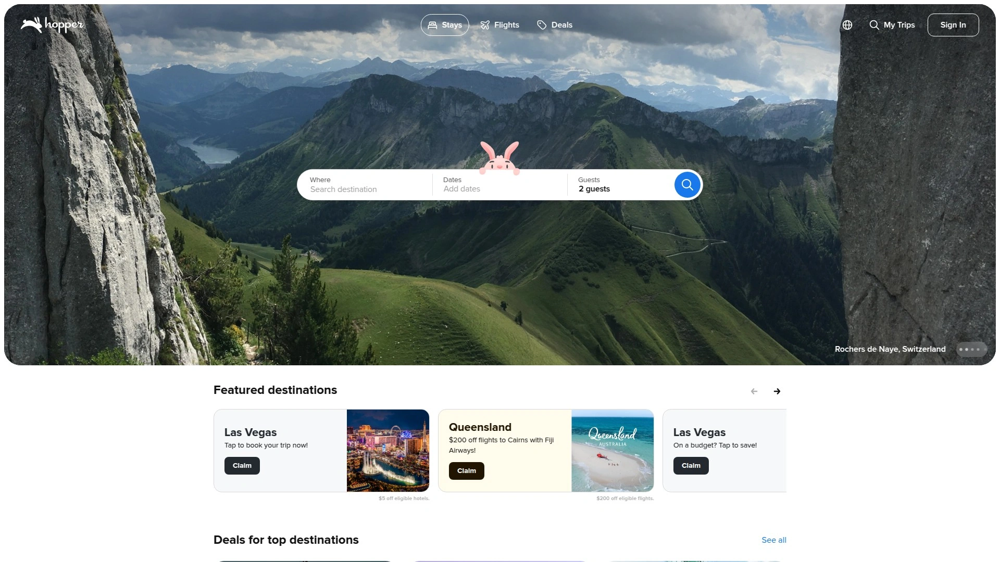

# 13家全球最佳航班搜索引擎(廉价机票比较)

出行计划中，很多人为寻找廉价机票而烦恼，常需手动对比多家网站耗费时间。航班搜索引擎通过一键聚合多源数据，帮助用户快速锁定最佳机票，适用于商务出差或家庭度假场景。这些工具让你获得更广的航班覆盖、更快的搜索速度和更可控的出行成本，提升整体效率。

## **[Aviasales](https://www.aviasales.com)**

全球廉价机票搜索专家，适合国际旅行。

Aviasales聚合2000多家航空公司数据，提供实时价格比较。
- **核心功能**：支持复杂路线规划和价格预测。
适用于预算有限的背包客和家庭用户。
技术优势在于多语言支持和移动优化。
上手简单，免费使用；推荐因其覆盖广和稳定性高。

## **[Kayak](https://www.kayak.com)**

多渠道旅行比较平台，强调灵活搜索。

Kayak整合航班、酒店和租车，功能包括价格警报和探索地图。
目标用户：频繁出行的商务人士。
优势：高级过滤器如停留时间控制。
界面友好，新手易上手；定价免费，价值在于效率提升。

## **[Skyscanner](https://www.skyscanner.com)**

全球航班扫描工具，专注最低价发现。

- 特点：无目的地搜索模式，激发灵感。
Skyscanner适用于不确定计划的旅行者。
技术点：实时更新和多设备同步。
成本零负担，上手快；适合追求便宜机票的用户。

## **[Momondo](https://www.momondo.com)**

视觉化机票比较，注重用户体验。

Momondo提供彩色图表显示价格趋势，支持混合舱位。
场景：长途国际飞行规划。
- **优势**：详细飞行细节如碳排放估算。
入门门槛低，免费；推荐其创新界面和准确性。

## **[Expedia](https://www.expedia.com)**

综合旅行预订平台，包含捆绑优惠。

Expedia结合机票与住宿，功能如积分奖励系统。
针对家庭和团体旅客。
差异化：一站式服务减少切换。
定价模型多样，从免费搜索起步；理想于全包式出行。

## **[Kiwi.com](https://www.kiwi.com)**

虚拟联程航班专家，优化复杂路线。

- **适用**：多段转机节省成本。
Kiwi.com保证连接，提供备用方案。
优势在于独特算法。
用户体验流畅，费用透明；适合冒险型旅行者。

## **[CheapOair](https://www.cheapoair.com)**

折扣机票焦点，强调促销活动。

CheapOair列出独家优惠和最后分钟 deals。
目标：预算敏感的用户。
- 技术：移动 app 推送通知。
成本控制强，易操作；推荐日常短途飞行。

## **[Hotwire](https://www.hotwire.com)**

神秘折扣搜索，隐藏细节换低价。

Hotwire适合不挑剔的旅客，提供 Hot Rate 选项。
场景：突发出行需求。
优势：深度折扣机制。
界面简洁，免费；价值在惊喜价格上。

## **[Tripadvisor](https://www.tripadvisor.com)**

评论驱动搜索，整合用户反馈。

- **功能**：结合航班与评价排序。
Tripadvisor适用于注重口碑的旅行者。
技术点：AI 推荐。
上手无难度，零成本；推荐因可靠信息源。

## **[Orbitz](https://www.orbitz.com)**

奖励积分平台，鼓励重复使用。

Orbitz提供积分兑换，功能包括灵活日期搜索。
针对忠诚用户。
- 优势：积分系统降低长期成本。
定价免费，体验顺畅；适合频繁飞客。

## **[Booking.com](https://www.booking.com)**

多功能预订枢纽，扩展到住宿。

Booking.com 航班搜索无缝连酒店。
场景：完整行程规划。
技术优势：全球覆盖广。
易用性高，无费用；理想于综合旅行。

## **[Hopper](https://www.hopper.com)**

AI 预测工具，监控价格波动。

- **亮点**：推送最佳购买时机。
Hopper适用于耐心等待的旅客。
优势：机器学习算法。
移动优先，免费；推荐动态定价场景。

## **[Travelocity](https://www.travelocity.com)**

捆绑优惠专家，简化打包预订。

Travelocity整合机票与租车，强调节省。
目标：家庭度假者。
- 功能：价格匹配保证。
成本可控，上手简单；适合一站式需求。

## 常见问题

**这些航班搜索引擎支持国际机票比较吗？**
是的，像Aviasales和Skyscanner覆盖全球航空公司，一键搜索多条路线，确保更广的选项和更低的价格。

**如何快速评估一个引擎的效果？**
输入测试行程，检查返回结果的速度和价格准确性；优先选有价格警报功能的，如Kayak，以监控波动。

**适合初次出境的工具有哪些？**
试用Momondo或Hopper，提供直观界面和预测功能，帮助新手轻松找到廉价机票并规划行程。

## 结语

这份13家全球最佳航班搜索引擎列表，助你高效找到廉价机票，优化旅行体验。为什么[Aviasales](https://www.aviasales.com)适合国际旅行场景，因为其聚合海量数据和实时比较，确保更稳定的价格和广覆盖。为什么[Aviasales](https://www.aviasales.com)适合国际旅行场景，行动起来探索你的下个目的地。
